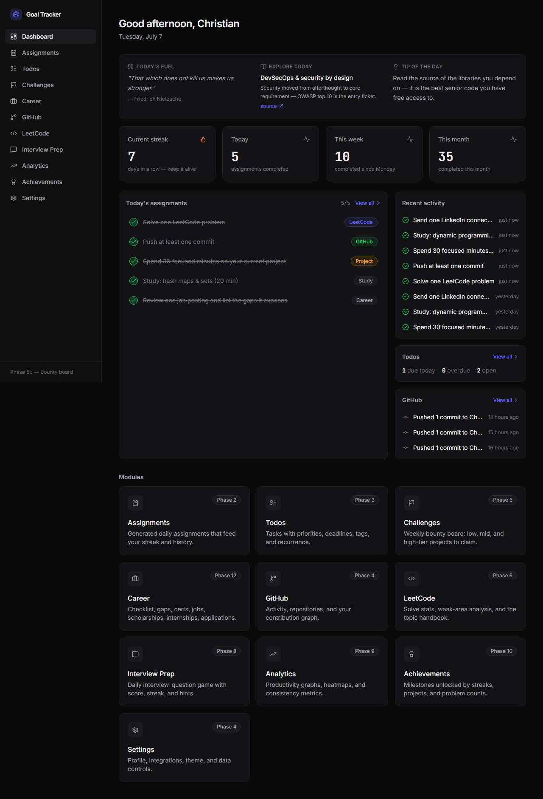
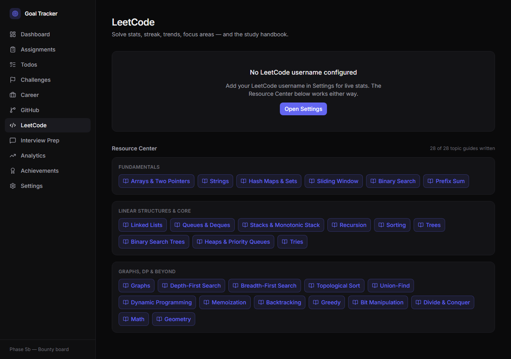

# Goal Tracker

[](https://github.com/Chripierre/goal-tracker/actions/workflows/ci.yml)
[](LICENSE)

A personal career operating system: daily assignments, a weekly project bounty
board, LeetCode statistics with a full algorithm study handbook, an interview
practice game, a career job-search tracker, and the analytics and achievements
that tie them together. Local-first and static — no backend, no database,
hosted directly from this repository.

Live: https://chripierre.github.io/goal-tracker/

## Screenshots

| Dashboard | LeetCode Resource Center |
|---|---|
|  |  |

## Features

- **Dashboard** — daily briefing (a rotating quote, a researched tech topic, an
  engineering tip), streak and progress stats, today's assignments, and a
  unified activity feed.
- **Assignments** — five tasks generated deterministically each day across
  LeetCode, GitHub, project work, study, and career-action categories.
  Completions drive the streak and a 14-day history.
- **Todos** — a personal task list decoupled from the streak: priorities,
  categories, tags, recurrence, list and calendar views, drag-and-drop
  ordering, and one-click export to Google Calendar.
- **Challenges** — a bounty board that posts new low/mid/high-tier project
  ideas every week (roughly a week, a month, or multi-month/team scope).
  Claiming one tracks milestones and a scored rubric through to an archived,
  optionally GitHub-repo-linked result.
- **Career** — the original job-search tracker ported in full: an action
  checklist, skill-gap analysis, certifications, portfolio projects, job
  leads, scholarships, and internships, plus a personal application log and
  networking list.
- **GitHub** — profile summary, activity feed, repository stats, and a
  contribution heatmap (falls back to a public chart when no token is set).
- **LeetCode** — solve statistics from a scheduled data pipeline (with a
  community-API fallback) and a 28-topic algorithm handbook: intuition,
  patterns, a working code template, common mistakes, and linked problems
  per topic.
- **Interview Prep** — a daily five-question timed quiz across fifteen
  interview categories, with hints, explanations, and a local leaderboard.
- **Analytics** — an activity heatmap, weekly trends, and consistency metrics
  derived from the same event history that powers the streak.
- **Achievements** — sixteen milestones unlocked across every module, with
  toast notifications and a gallery.
- **Settings** — profile and integration configuration, an app lock that
  encrypts the stored GitHub token at rest, and data export/import (including
  a one-time importer for the original vanilla-JS tracker's data).

## Architecture

The app is a static single-page application: there is no server, and every
user's data lives only in their own browser's `localStorage`. This is a
deliberate simplification, not a limitation worked around — it removes an
entire class of infrastructure and, combined with the design below, means no
user's data is ever visible to anyone but them.

The core design decision is an **append-only activity log**. Every meaningful
action — completing an assignment, finishing a challenge, playing the daily
quiz — appends an immutable event. Streaks, weekly and monthly progress,
analytics, and achievement unlocks are all pure functions computed over that
log, never separately tracked counters. This keeps the numbers always
consistent with history and makes the logic unit-testable without a UI.

Reference content (career listings, challenge bounties, the LeetCode
handbook) ships as static data in the repository, since it applies to anyone
using the app. Personal data — todos, application logs, streak history,
unlocked achievements — stays local and is never committed anywhere.

State is versioned: every schema change ships with an additive migration and
a test, so existing users are never broken by an update. See
[SECURITY.md](SECURITY.md) for the full threat model, including how the
optional GitHub token and Google Calendar credentials are handled.

## Technologies used

| Layer | Choice |
|---|---|
| Build | Vite |
| UI | React 19, TypeScript (strict) |
| Styling | Tailwind CSS 4 |
| Routing | React Router 7 |
| State | Zustand, with versioned `persist` migrations |
| Testing | Vitest |
| Linting | ESLint 9 (flat config), Prettier |
| CI/CD | GitHub Actions → GitHub Pages |
| Integrations | GitHub REST/GraphQL API, Google Identity Services (Calendar), LeetCode GraphQL (via a scheduled Action) |

## Installation

Requires Node 20.19 or later (developed on Node 24).

```
git clone git@github.com:Chripierre/goal-tracker.git
cd goal-tracker
npm install
```

## Development

```
npm run dev         # dev server with hot reload
npm test             # unit tests (Vitest)
npm run typecheck    # tsc --noEmit
npm run lint          # ESLint
npm run build         # typecheck, then production build to dist/
npm run preview       # serve the production build locally
```

## Deployment

Every push to `main` runs typecheck, lint, and the full test suite; on
success, the production build is deployed to GitHub Pages automatically
(`.github/workflows/ci.yml`). A separate scheduled workflow
(`leetcode-data.yml`) refreshes LeetCode statistics daily.

## Environment variables

None are required to build or run the app — there are no build-time secrets.
Optional integrations are configured at runtime, in-app, under **Settings**,
and stored in the browser rather than in the environment:

| Setting | Where it's used | Notes |
|---|---|---|
| GitHub username | GitHub and Analytics modules | Public; no credential needed for public data. |
| GitHub personal access token | Higher API limits, private contributions, repo auto-creation | Optional. Can be encrypted at rest with the in-app app lock. |
| LeetCode username | LeetCode stats | Public. |
| Google OAuth Client ID | Todo → Calendar sync | Public app identity, not a secret; scoped by authorized origins in Google Cloud Console. |

## Project structure

```
src/
  app/            router, layout shell, navigation config
  components/     shared UI primitives (Card, Badge, Button, ...)
  features/       one folder per module (dashboard, assignments, todos, ...)
  lib/            pure domain logic: storage/migrations, streaks, achievements,
                   assignment and challenge generation, API clients, crypto
  data/           static reference content (career listings, bounties,
                   the LeetCode handbook, assignment templates)
  styles/         design tokens and global styles
scripts/          one-off and scheduled data pipelines (career-data extraction,
                   LeetCode stats fetch)
legacy/           the original vanilla-JS tracker, kept for reference and as
                   the source for the legacy-data importer
```

## Roadmap

Shipped: the full daily-assignment loop, personal todos with calendar sync,
the weekly bounty board, GitHub integration, LeetCode stats and handbook,
the interview practice game, analytics, achievements, the career module, and
an app-level security pass (encrypted token storage, a content security
policy, dependency scanning).

Planned: multi-device sync via a private GitHub data repository; Google
Calendar reminder notifications end-to-end; a general accessibility and
performance pass.

## Contributing

This is a personal project, built and maintained for personal use. It isn't
actively seeking outside contributions, but bug reports and questions via
GitHub issues are welcome.

## License

MIT — see [LICENSE](LICENSE).
